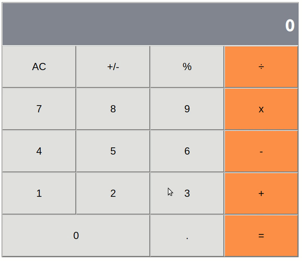

# react-calc

> Calculator build with React!

This calculator app was developed using React, it is deployed on heroku.
In uses the Big.js library to manage large numbers.

<p align="center">
  <a href="https://big-react-calc.herokuapp.com">
    
  </a>
</p> 

## Liveview
  - [Live version](https://big-calc-react.herokuapp.com) 
  
  ## Built With
  - JavaScript (ES6)
  - React


## Deploy
To deploy this project localy, download or clone this repo
1. Install the required libraries (react, react-dom, big, etc.)
```
    npm install
```
2. Run the server locally:
```
    $ npm start
```

## Author

👤 Franco Rosa

- Github: [@FrancoRosa](https://github.com/FrancoRosa)
- Linkedin: [Franco Rosa](https://www.linkedin.com/in/francoro)

## 🤝 Contributing

Contributions, issues and feature requests are welcome!
Feel free to check the [issues page](issues/).

## Show your support

Give a ⭐️ if you like this project!

## Acknowledgments

- Team #94 Capricornus Microverse, for the morning code reviews.

## 📝 License

This project is [MIT](lic.url) licensed.